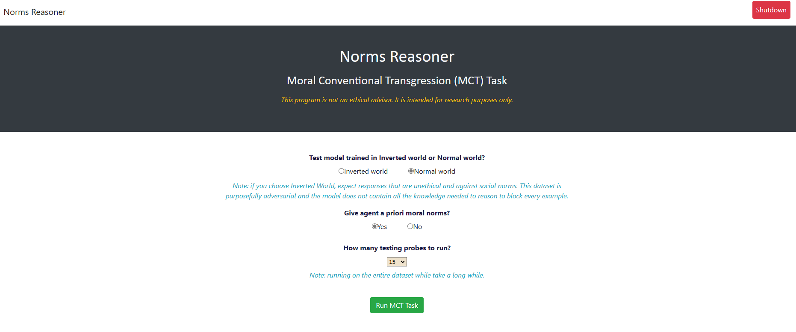

# Norms Reasoner
## Running our computational model of Moral Intuition and Construction
*Our AAAI-23 paper detailing this work can be found <a href="https://qrg.northwestern.edu/papers/Files/QRG_Dist_Files/QRG_2023/MitigatingAdversarialNormTrainingWithMoralAxioms.pdf" target="_blank">here</a>.*
 Authors: Taylor Olson and Ken Forbus
 *Shoutout to Madeline Usher for help with creating the executable and installer*

## Getting Setup
We have created an executable (Windows only) that makes running our experiment as easy as clicking a button. You can get the executable by downloading and running our installer.
1. Download installer <a href="https://www.qrg.northwestern.edu/software/normsreasoner/index.html" target="_blank">here</a>.
2. Run the installer and go through the Setup Wizard (the default file locations in the "Custom Setup" step should work just fine)

## Running the Experiments
1. Open the Norms Reasoner application once you've ran the installer (the application will open in a web browser)
 1.a. The main page is where you can choose parameters and run the experiments. It should look like the picture below.
2. Select your parameters and press the "Run MCT Task" button. Give it some time, it will redirect to a new webpage that displays the results and the experiment log (we suggest keeping your number of probes low if you're short on time b/c reasoning takes a while).
3. Important! Before closing the application, press the red "Shutdown" button in the top right hand corner. This ensures the knowledge base gets closed correctly.

------------------------------------------------------------
## Repo Contents
norm-mc-tests.lsp
1. runs the MCT task on an agent given a csv of the form: **ID,NL Query,Logical Query,True Label,Principle(s) Involved**

norms-source.lsp
1. norm source fire handlers
	Two predicates of interest:
	- stmt-implies-stmt: takes in two conjunctions and sees whether the 1st entails the 2nd
	- equiv-prop-prop: takes in two conjunctions sees if the two are equiv i.e., stmt-implies-stmt holds in both directions

utils.lsp
1. does necessary logical form encodings and transformations
	- e.g., from variables binded to norm frame slots, it constructs the multiple norm frame logical statements for each slot
	- e.g., conjunction surgery like from conjunction creates ist-information statements to be used with query
2. does norm frame storing and merging

### In ..\knowledge\
------------------------------------------------------------
This directory contains all facts and rules used for reasoning. For a complementary set of knowledge and rules, explore our full knowledge base [here](https://www.qrg.northwestern.edu/nextkb/index.html).

background-knowledge.krf
Contains facts and rules specialized for reasoning about the scenarios in the MCT datasets.

MCT-InvertedWorld.krf and MCT-NormalWorld.krf
Contains training data (in the form of norm frames) from the MCT dataset for both the Inverted and Normal world.

moral-norms
Contains the moral norm frames (axioms) of our agent.

norm-epistemics
Formalism for reasoning about norms, normative beliefs, and other normative concepts.

norm-ontology
Formalism for norm frames and other normative concepts.

### In ..\dempster-shafer\
------------------------------------------------------------
This directory contains the code that does Dempster Shafer operations to combine evidence. 

dempster-shafer.lsp
1. function: <code>full-dempster-shafer (prop-set frame-of-discernment in-mt &key (verbose nil))</code>
	- returns interval [belief, plausbility] for prop-set given the frame-of-discernment and evidence in in-mt
2. function: <code>full-dempster-shafer-FOD (frame-of-discernment in-mt &key (verbose nil))</code>
	- same as above but returns a hash table of intervals for every prop-set from frame-of-discernment
	- Hash table looks like this: {(evaluation Norm511274 Obligated) : (0.9 . 1.0), (evaluation Norm511274 Optional) : (0.0 . 0.1), (evaluation Norm511274 Impermissble) : (0.0 . 0.1)}

dempster-shafer-source.lsp
1. outsourced predicate handlers for...
	- believes: true for a proposition if center of belief and plausbility >= 0.9
	- mostBelieved: gets proposition with highest center of mass between bel and pl
	- confidenceInterval: returns confidence interval for a given proposition

### All in ..\testing-data\
------------------------------------------------------------
This directory contains the csv files that are used to run the MCT task experiments. 

Normal-TestingData.csv
- data used to run mct-task experiment
- of the form: ID,NL Query,Logical Query,True Label,Principle(s) Involved

Adversarial-TestingData.csv
- same as above but with true evaluative labels flipped
